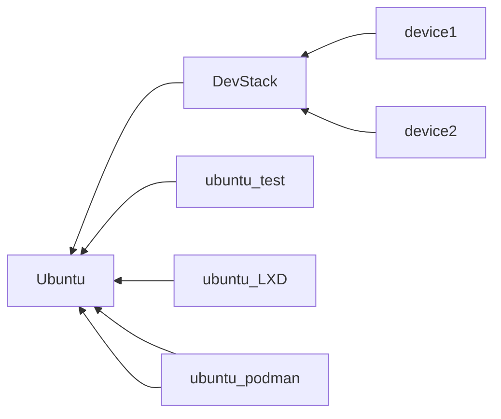

THE_cloud structure



```yaml
deviceTest:
  name: device1
  sname: device1Server
  uname: rui
  pass : rui
  user,hostfwd: ::11022-:22
  user,hostfwd: ::11080-:80
  tap:
    ip: 192.168.100.1
    mac: 54:52:00:00:00:01
  bashrc: |
    clear
    echo "    .___        ____  "
    echo "  __| _/       /_   | "
    echo " / __ |  ______ |   | "
    echo "/ /_/ | /_____/ |   | "
    echo "\____ |         |___| "
    echo "     \/               "
    sudo ip addr add 192.168.100.1/24 dev enp0s3
    sudo ip link set enp0s3 up
    ifconfig
device1:
  name: device1
  sname: device1_s
  uname: rui
  pass : ruirui
  user,hostfwd: ::11022-:22
  user,hostfwd: ::11080-:80
  tap:
    ip: 192.168.0.1
    mac: 54:52:00:00:00:01
  bashrc: |
    clear
    echo "    .___        ____  "
    echo "  __| _/       /_   | "
    echo " / __ |  ______ |   | "
    echo "/ /_/ | /_____/ |   | "
    echo "\____ |         |___| "
    echo "     \/               "
    sudo ip addr add 192.168.100.1/24 dev enp0s3
    sudo ip link set enp0s3 up
    ifconfig
device2:
  name: device2
  sname: device2_s
  uname: rui
  pass : rui
  user,hostfwd: ::12022-:22
  user,hostfwd: ::12080-:80
  tap:
    ip: 192.168.0.2
    mac: 54:52:00:00:00:02
  bashrc: |
    clear
    echo "    .___        ________   "
    echo "  __| _/        \_____  \  "
    echo " / __ |  ______  /  ____/  "
    echo "/ /_/ | /_____/ /       \  "
    echo "\____ |         \_______ \ "
    echo "     \/                 \/ "
    sudo ip addr add 192.168.100.2/24 dev enp0s3
    sudo ip link set enp0s3 up
    ifconfig
  
  


device1-1:
  name: device1
  sname: device1_s
  user:
    - uname: rui
      pass: ruirui
    - uname: stack
  user,hostfwd: ::8822-:22
  stack:
    ADMIN_PASSWORD: secret
    DATABASE_PASSWORD: $ADMIN_PASSWORD
    RABBIT_PASSWORD: $ADMIN_PASSWORD
    SERVICE_PASSWORD: $ADMIN_PASSWORD
    HOST_IP: 10.0.2.15

    This is your host IP address: 10.0.2.15
    This is your host IPv6 address: fec0::5054:ff:fe12:3456
    Horizon is now available at http://10.0.2.15/dashboard
    Keystone is serving at http://10.0.2.15/identity/
    The default users are: admin and demo
    The password: secret
```